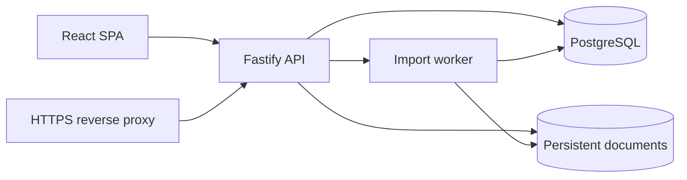
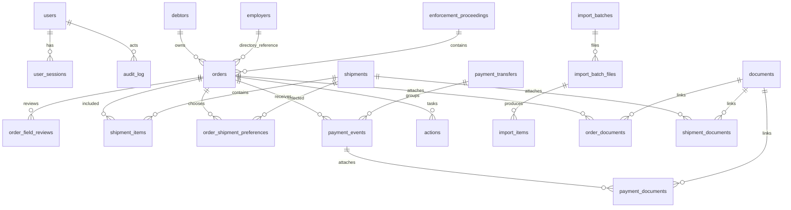

# Архитектура и модель PostgreSQL

Статус: согласовано пользователем по предложению. Bootstrap, первичная SQL-схема, авторизация, защищённые документы, PDF-импорт с подтверждением, подэтапы 7.1 рабочего реестра, 7.2 отправлений, 7.3 поступлений, 7.4 контроля, 8 XLSX-экспорта, 9 поиска/hardening и deployment-подготовка этапа 10 созданы.

## Зафиксированные решения

- Новая БД стартует пустой: строки и суммы из `REESTR.xlsm` не переносятся.
- Неполные реквизиты PDF сохраняются с предупреждением и происхождением значения.
- Из солидарного описания выделяется один конкретный должник из контекстного блока документа.
- Базовый контроль использует интервалы 7 дней после отправки, 30 после вручения, 30 после проверки/платежа УК и напоминание за 3 дня.
- OCR, внешние AI/OCR-сервисы и векторный поиск откладываются; основной импорт и приложение работают без них.
- Пользовательский импорт Excel не создаётся; XLSX предназначен только для отчётов.
- Для первого deployment используются локальный постоянный том документов и обычное округление денежных входных значений до двух знаков (`half-up`); перенос в S3-совместимое хранилище остаётся отдельной операционной задачей.

## Предлагаемый стек

| Слой | Предложение | Причина |
|---|---|---|
| Приложение | Node.js 24 LTS, TypeScript, единый self-hosted монолит | Один образ и простой перенос на AdminVPS; серверная бизнес-логика в одном месте |
| API | Fastify, JSON API, один origin с интерфейсом | Явные серверные проверки прав и удобные интеграционные тесты |
| Интерфейс | React + Vite, русская SPA | Карточки, таблицы, предпросмотр PDF и фильтры без зависимости от платформенного хостинга |
| Доступ к БД | Drizzle ORM + параметризованные SQL для отчётов | Типы схемы, воспроизводимые миграции PostgreSQL и контроль сложных агрегатов |
| БД | PostgreSQL 16 или 17, версия фиксируется в Compose | `NUMERIC`, `JSONB`, `timestamptz`, полнотекстовый поиск и транзакции |
| PDF | Локальный `pdfjs-dist` для извлечения текста | Документы не отправляются внешним сервисам; OCR остаётся отдельным этапом |
| XLSX | `ExcelJS` только для экспорта | Форматы, фильтры, печать и стили; пользовательского импорта нет |
| Пароли | Argon2id, серверные сессии в БД | Нет токенов и паролей в Git; отзыв сессий централизован |
| Файлы | Постоянный том приложения через Storage Adapter | Работает на AdminVPS; переход на S3-совместимое хранилище не меняет доменную модель |

Дополнительный Redis не предлагается. Длительные импорты обслуживает отдельный процесс worker с очередью в PostgreSQL; это добавляет только второй процесс того же образа и не создаёт неподтверждённую инфраструктурную зависимость.

## Процессы и границы модулей

- **API** отвечает за аутентификацию, права, транзакции, доменные проверки, предпросмотр и выдачу отчётов.
- **Worker** забирает `import_batches` с блокировкой `FOR UPDATE SKIP LOCKED`, извлекает текст, определяет страницы и сохраняет результаты предпросмотра. До подтверждения worker не создаёт рабочие записи.
- **PostgreSQL** — единственный источник истины для сущностей, статусов, финансовых агрегатов, очереди и аудита.
- **Storage Adapter** сохраняет исходные PDF, документы отправлений и платёжные файлы с ключом, хешем и метаданными; временные файлы удаляются после обработки.
- **Reverse proxy** завершает HTTPS и передаёт приложение по закрытой сети; PostgreSQL наружу не публикуется.

## Сущности и связи

## Таблицы и инварианты

Все таблицы получают внутренний UUID, `created_at`, `updated_at` и, где применимо, автора и `version`. Публичные коды — отдельные неизменяемые `TEXT`.

| Таблица | Назначение и ключевые поля | Основные ограничения |
|---|---|---|
| `users` | email/login, имя, `password_hash`, роль, активность | Уникальный нормализованный login; пароль только Argon2id; отключение вместо удаления |
| `user_sessions` | хеш cookie-токена, user, сроки, отзыв, last_seen | Сырой токен не хранится; истёкшие сессии удаляются заданной политикой |
| `debtors` | ФИО, дата рождения, адрес, внешние идентификаторы как текст | ФИО не уникальный ключ; автоматическое объединение запрещено |
| `employers` | справочное название, ИНН, адрес, контакты, статус проверки | Похожие названия не объединяются автоматически; ИНН работодателя — `TEXT` |
| `enforcement_proceedings` | номер/дата ИП, исполнительный документ, орган, дело, исходные идентификаторы | Номер ИП не заменяет идентификатор постановления и не является единственным ключом дубля |
| `orders` | `public_code` (`П-`), debtor, proceeding, nullable employer, снимок реквизитов работодателя, номер/дата постановления, процент удержания, статусы, ответственный, ручная дата, архив, `version` | Один order = один должник + один работодательный контекст; неполнота допустима; публичный код и внутренний UUID неизменяемы; PATCH проверяет `version` |
| `order_field_reviews` | поле, извлеченное значение, ручное значение, статус (`missing`, `incomplete`, `unreadable`, `needs_review`, `verified`), источник страниц/фрагмент, автор проверки | Ручное значение не затирается повторным импортом; история статуса сохраняется |
| `shipments` | `public_code` (`К-`), получатель/адрес-снимок, составное описание, даты, трек, статус, возврат, ответственный | До фиксации отправки допускается черновик; после `sent_at` получатель, адрес и состав неизменяемы |
| `shipment_items` | shipment + order, порядок, снимок реквизитов | Уникальная пара shipment/order; оба объекта должны существовать |
| `order_shipment_preferences` | ручной выбранный конверт, причина и автор | Выбор только среди конвертов с этим order; неоднозначность не скрывается |
| `payment_transfers` | связь этапов одного перевода, внешний reference, дата/примечание | Связь не превращается в общий финансовый итог |
| `payment_events` | `public_code` (`С-`), order или исходный неизвестный ID, этап, источник, дата, `amount NUMERIC(18,2)`, подтверждение, ИП-сверка, период, документы | Допустимый итог только при всех правилах; ошибочные события сохраняются с причинами |
| `actions` | задача, order, исполнитель, срок, ручная дата, основание (`manual`/отправка/вручение/платёж УК), статус, результат, выполнено, `version` | Версия защищает от тихой перезаписи; завершение order прекращает напоминания, но не удаляет actions |
| `documents` | storage key, SHA-256, размер, MIME, имя, статус, владелец, загружен | Файл находится на постоянном томе; скачивание только через авторизованный API |
| `order_documents`, `shipment_documents`, `payment_documents` | связи документов с сущностями и типом | Внешние ключи и аудит прикрепления |
| `import_batches` | пакет, автор, статус, parser version, подтверждение | Рабочие записи создаются только отдельной транзакцией подтверждения |
| `import_batch_files` | файл, checksum, страницы, storage key, состояние | Идемпотентность по хешу в пределах пакета; исходник сохраняется |
| `import_items` | диапазон страниц, raw text, extracted JSONB, manual JSONB, warnings, duplicate state, решение сотрудника | Продолжения и уведомления связываются с item; item может быть исключён без потери исходника |
| `control_settings` | timezone, интервалы 7/30/30, reminder 3 | Значения валидируются; настройки версионируются и аудируются |
| `audit_log` | actor, время, объект, действие, old/new JSONB, request id | Запись аудита и изменение данных в одной транзакции, где применимо |
| `document_chunks` | извлечённый текст по страницам/фрагментам, `tsvector` | Полнотекстовый слой не является источником реквизитов; векторных колонок нет на этом этапе |

Справочник работодателей используется явно. Поля конкретного постановления хранят снимок на момент проверки/отправки и не переписываются изменениями справочника.

## Постоянные коды и деньги

- В PostgreSQL создаются отдельные sequence для orders, shipments и payment events. Форматирование (`П-0001`, `К-0001`, `С-0001`) выполняется в транзакции; пропуски после rollback допустимы.
- Код показывается как сохранённый только после commit. Восстановление поднимает sequence до максимального существующего номера и никогда не уменьшает верхнюю границу.
- Внутренние связи используют UUID, а публичные коды и номера ИП — текст.
- Денежные поля — `NUMERIC(18,2)`. API принимает и возвращает десятичные строки; арифметика выполняется PostgreSQL/decimal-библиотекой, не JS `Number`.
- Округление: хранение до двух знаков; входные значения с большим масштабом требуют явной проверки и согласованного банковского/обычного правила, которое будет закреплено до реализации платежей.

## PDF-импорт и commit

1. API сохраняет файл и checksum, создаёт batch/file.
2. Worker локально извлекает текст по страницам и фиксирует parser version.
3. Парсер определяет границы, извлекает кандидатов и источник каждого поля.
4. Проверки выявляют пропуски, расхождения работодателя, возможные дубли и неверные связи.
5. UI показывает все item: успешные, спорные и нераспознанные; сотрудник исправляет или исключает item.
6. Перед commit сервер повторяет проверку конфликтов и создаёт order/document/audit в одной транзакции. Импорт не создаёт shipment, delivery, execution или payment event.

OCR, внешние AI/OCR и векторные кандидаты не входят в этот поток. При нечитаемом PDF сохраняется источник и доступен ручной ввод.

В подэтапе 6.2 пакет принимает несколько PDF через multipart. Каждый файл получает отдельный `import_batch_file` и `import_item`; ошибка чтения одного файла сохраняется как `failed` с причиной и не скрывает остальные. Пользователь должен явно исключить ошибочный item через endpoint с причиной; commit без такого решения блокируется. Перед commit сервер повторно проверяет состояние batch, неуспешные файлы, обязательного должника и возможные дубли. Только запрос с явным `confirm=true` создаёт в одной транзакции debtor, proceeding, employer (если указан), order, связи документа и проверки полей; отправления, доставку и платежи импорт не создаёт. Блокировка batch `FOR UPDATE` делает повторный или одновременный commit одноразовым: второй запрос видит `committed` и не создаёт дубли.

## Отправления (подэтап 7.2)

`shipments` создаётся как черновик с составом `shipment_items`, снимками реквизитов постановлений, получателем, адресом, типом, трек-номером и ответственным. API проверяет, что все постановления существуют и не архивны, выводит предупреждения о разных работодателях/адресах и непроверенных реквизитах, а переход в `sent` разрешает только для проверенного единого получателя и непустого состава. Переходы `sent → delivered/returned` требуют корректных дат; возврат хранит причину.

После `sent_at` сервер запрещает менять получателя, адрес и состав; изменение строк состава дополнительно защищено PostgreSQL-триггером на `shipment_items`. PATCH использует `version` и `FOR UPDATE`, а даты возврата проверяются относительно отправки и вручения. Представление `current_shipments` сохраняет неоднозначность одинаковых дат, а `order_shipment_preferences` хранит ручной выбор сотрудника и возвращает статус `manual` для выбранного конверта.

## Поступления (подэтап 7.3)

`payment_events` хранит отдельные этапы `fssp` и `uk`; `payment_transfers` объединяет события одного перевода без сложения этапов в общий приход. Событие может ссылаться на постановление или хранить неизвестный внешний ID, а также содержит сумму `NUMERIC(18,2)`, дату, период, источник, платёжный документ, примечание, состояние подтверждения, сверку номера ИП и подтверждающие документы.

Итоги используют только подтверждённые и сверенные события с источником `Этот работодатель`, известным постановлением и непустым номером ИП. Одинаковая комбинация получателя, этапа, источника, даты, суммы и периода выбирает одну запись; возможный дубль виден в API и требует явного решения для подтверждения. Поэтому записи сохраняются для уточнения, но не удваивают итог. Неизвестные ID и причины исключения остаются доступными в реестре.

API платежей использует `version`, `FOR UPDATE` и аудит; `admin/editor` изменяют данные, `viewer` только читает. Месячная сводка возвращает отдельные итоги ФССП и УК и количество исключённых событий.

## Реестр постановлений (подэтап 7.1)

API `GET /api/orders` выполняет серверные поиск по нескольким полям, фильтры статуса/ответственного/неполных реквизитов, сортировку и пагинацию. `GET /api/orders/:id` возвращает карточку и аудит. `POST /api/orders` и `PATCH /api/orders/:id` доступны только `admin/editor`; PATCH принимает полную карточку и обязательную ожидаемую версию. Обновление блокируется транзакцией `FOR UPDATE` и условием `version`, поэтому повторное или одновременное редактирование возвращает конфликт без тихой перезаписи. Архивирование устанавливает статус и дату/автора архива в той же транзакции.

Реквизиты работодателя хранятся как снимок постановления и получают новые записи `order_field_reviews`; для отображения берётся последняя проверка каждого поля. Отсутствующее или непроверенное наименование, ИНН либо адрес выставляет `incomplete=true`. UI показывает таблицу, карточку, ручную форму, историю, выбор столбцов и отдельное предупреждение; неподдерживаемые отправления, платежи и контроль в реестре не имитируются.

## Контроль (подэтап 7.4)

Настройки контроля хранятся как эффективные версии в `control_settings`: по умолчанию используется `Asia/Yekaterinburg`, 7 дней после отправки, 30 после вручения, 30 после подтверждённого и сверенного платежа УК, напоминание за 3 дня. Настройки изменяет только `admin`; каждая версия проверяется на конфликт и попадает в аудит.

`GET /api/control` строит контрольную ленту из рабочих постановлений, отправлений и допустимых платежей. Приоритет автоматического основания: подтверждённый платеж УК, вручение, отправка. Для действия с `manual_due_date` ручной срок имеет приоритет над автоматическим. Состояния `overdue`, `today`, `soon`, `scheduled`, `assign_action`, `assign_responsible`, `completed` и `archived` рассчитываются на сервере в едином timezone; завершённые и архивные записи не создают напоминаний.

`actions` создаются и изменяются через `admin/editor`, назначение проверяется по активному пользователю, а PATCH требует `expectedVersion` и блокировку `FOR UPDATE`. Одновременные изменения дают один успешный ответ и один конфликт. Карточка действия возвращает историю аудита; viewer может читать контроль, но не изменять его.

Представление `valid_payment_events` агрегирует платежи до соединения с orders; отдельные представления дают итоги ФССП и УК и причины исключения. Представление `current_shipments` возвращает последний корректный конверт; одинаковые timestamps возвращают `ambiguous`, а не случайную строку. Реестр и XLSX используют одни сервисы/представления, чтобы фильтры, итоги и актуальный конверт не расходились.

## XLSX-экспорт и отчёты (этап 8)

`GET /api/reports/overview` и `GET /api/reports/orders.xlsx` используют общий запрос выборки постановлений с серверными фильтрами `q`, `status`, `responsibleId`, `incomplete`, `includeArchived`, выбором `ids`, сортировкой и направлением. Пагинация намеренно не применяется к экспорту: выгружается вся отфильтрованная выборка.

XLSX создаётся библиотекой `ExcelJS` без макросов и содержит листы «Сводка» и «Реестр». На листе реестра сохраняются выбранные столбцы, текстовые форматы для UUID/ИНН/номеров ИП, календарные даты с форматом `ДД.ММ.ГГГГ`, денежные значения с двумя знаками, автофильтр, повторяемая шапка и печать в альбомной ориентации. Сводка содержит дату и timezone формирования, описание фильтра, количество записей, неполные реквизиты, контрольные состояния, вручённые постановления без подтверждённого платежа УК, платежи к уточнению и отдельные суммы ФССП/УК. Экспорт не является резервной копией и не поддерживает обратный импорт.

## Поиск, тестирование и hardening (этап 9)

Реестр и отчёты принимают ограниченный параметр `q` (до 200 символов). По умолчанию применяется параметризованный поиск по фрагменту через `lower(concat_ws(...)) LIKE lower($n)`. При `mode=fulltext` используется PostgreSQL `to_tsvector('simple', ...) @@ websearch_to_tsquery('simple', $n)` по тем же полям. Неизвестный режим отклоняется с `400`; векторные индексы и векторный поиск не требуются для базовой работы и не добавлялись.

API централизованно добавляет `X-Content-Type-Options: nosniff`, `X-Frame-Options: DENY`, `Referrer-Policy: no-referrer`, ограничивающий `Permissions-Policy`, CSP и `Cache-Control: no-store` для API-ответов. Целевые тесты проверяют нормализацию режима, ограничение длины и параметризацию предикатов; интеграционная проверка покрывает оба режима поиска, ошибки режима и отсутствие авторизации. Production-зависимости проверяются `npm audit --omit=dev --audit-level=high`.

## Предлагаемая матрица прав

| Возможность | admin | editor | viewer |
|---|:---:|:---:|:---:|
| Просмотр и поиск рабочих данных | да | да | да |
| Создание/изменение orders, shipments, payments, actions | да | да | нет |
| PDF-импорт и ручное подтверждение | да | да | нет |
| XLSX-экспорт | да | да | да* |
| Открытие разрешённых документов | да | да | да |
| Настройки контроля | изменение | чтение | чтение |
| Управление сотрудниками и ролями | да | нет | нет |
| Резервное копирование/восстановление | да | нет | нет |
| Архивирование/восстановление записей | да | по согласованному правилу | нет |

`*` Экспорт для viewer предлагается разрешить только с теми же фильтрами и доступными ему данными. Любая операция проверяется на сервере.

## Деплой и восстановление

Предлагаемый Compose содержит `app`, `worker` и `postgres`; reverse proxy/HTTPS может быть отдельным существующим сервисом AdminVPS или отдельным зафиксированным контейнером после проверки занятых портов. PostgreSQL подключён только к внутренней сети. Рабочие файлы лежат в именованном постоянном томе.

Резервная копия включает `pg_dump`, архив документов, manifest с версиями и SHA-256, настройки без секретов и журнал выполнения. Копия должна уходить за пределы VPS с политикой хранения. Восстановление сначала проверяется в отдельной среде; перед заменой рабочих данных создаётся защитная копия, sequence и роли не уменьшаются и не теряются.

## Границы согласования

Пользователь согласовал предложенный стек TypeScript/Fastify/React/Vite/Drizzle/PostgreSQL, worker без Redis, матрицу ролей, обычное округление `half-up` и локальный постоянный том документов для первого deployment. Параметры AdminVPS потребуются только на этапе deployment; подключение к нему сейчас не выполняется.
